# 一.Gradle和Groovy的引入
## 1.1 本课程适合的人群
* 从事Android相关的开发人员
* 从事Java相关开发人员
* 有项目构建基础的人群
## 1.2 为什么要学习Gradle
* 一款最新的，功能最强大的构建工具，用它逼格更高
* 使用Groovy或Kotlin代替XML,使用程序代替传统的XML配置，项目构建更灵活
* 丰富的第三方插件，让你随心所欲使用
* 完善Android，Java并发技术体系
## 1.3DSL或GPL
DSL其实是Domain Specific Language的缩写，中文翻译为领域特定语言（下简称DSL）;而与DSL相对的就是GPL,是
General Purpose Language的简称，即通用编程语言，也就是我们非常熟悉的Java、Python以及C语言等等。
## 1.4Groovy的引入
Groovy是一种JVM语言，它可以编译为与Java相同的字节码，然后将字节码文件交给JVM去执行，并且可以与Java类无缝地互操作，Groovy可以透明地与Java库和代码交互，
可以使用Java所有的库。
Groovy也可以直接将源文件解释执行。
它还极大地清理了Java中许多冗长的代码格式。
如果你是Java程序员，那么学习Groovy简直毫无压力。
Groovy尚未成为主流的开发语言，但是它已经在测试（由于其简化的语法和元编程功能）和构建系统中占据了一席之地。
即支持面向对象编程也支持面向过程编程，即可以作为编程语言也可以作为脚本语言

# 二、环境搭建
## 2.1JDK的安装

## 2.4 下载groovySDK
https://groovy.apache.org/download.html

## 2.5 groovy-sdk目录结构
将apache-groovy-sdk-4.0.0.zip解压到合适的位置即可，主要目录结构就是bin和doc:

bin目录：

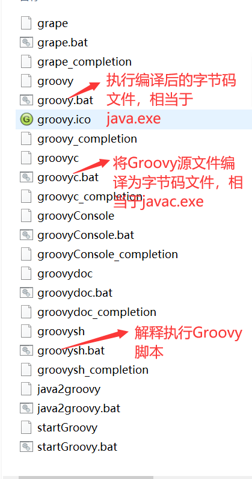

doc目录：

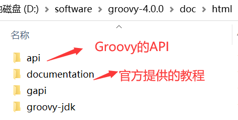
## 2.6 配置Groovy环境变量
GROOVY_HOME的配置，值为刚才解压的路径：

PATH的配置，借助GROOVY_HOME：

在控制台中输入groovy -version,校验是否正确安装
## 2.7 IntelliJ IDEA的下载和安装
## 2.8 创建Groovy工程并编写第一段程序
* 1.创建Groovy的项目

* 2.新建类
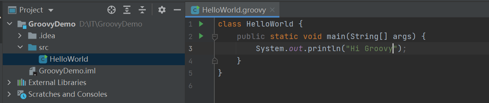
  
运行结果：

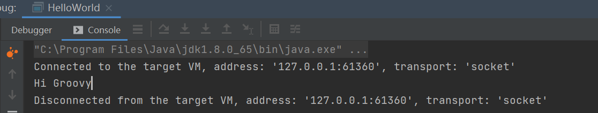

精简语法：

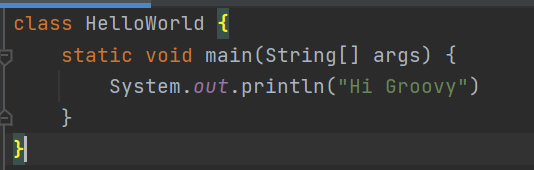

再次精简

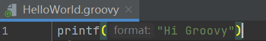

# 三、Groovy语法解析
## 3.1 变量的类型
在Groovy中，没有基本数据类型，只有对象类型，表面上我们定义基本数据类型，但实际都会帮我们装箱处理：
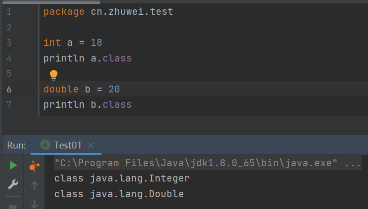

无论定义基本数据类型还是对象类型，其实都会帮我们转为对象类型

但是对于程序员来说，写代码没有影响

## 3.2 变量的定义
*(1)* 强类型定义方式
数据类型 变量名 = 初始值

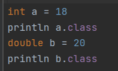
*(2)* 弱类型定义方式

根据值可以推断出变量的数据类型，所以类型不用显示声明，直接用def即可

def 变量名 = 初始值

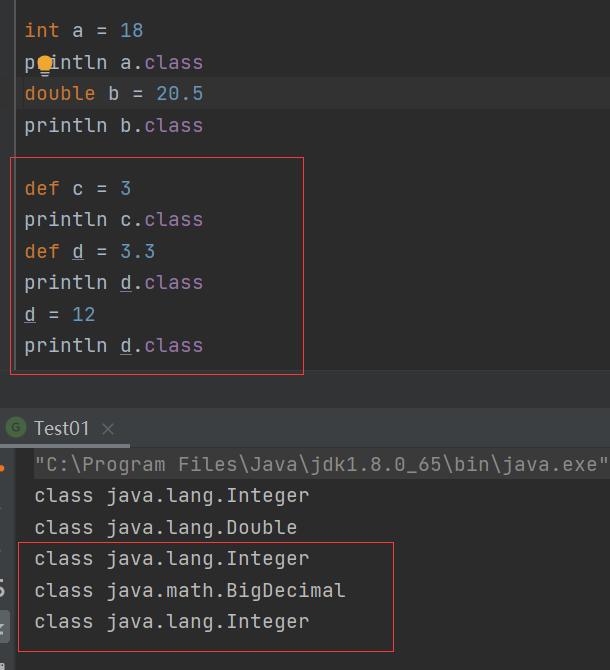

用def这种弱类型定义可以随便改变类型。

如果不希望别人改变数据类型，用强类型

如果是你自己使用，并且想要随意更改类型，那么就用弱类型

## 3.3 字符串
### 3.3.1 常用的定义字符串的方式
*(1)单引号定义方式：*

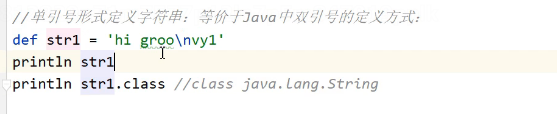

*(2)双引号定义方式：*

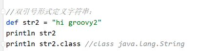

*(3)三引号定义方式：*

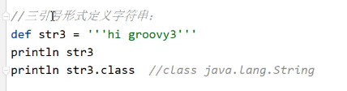

三种方式区别：

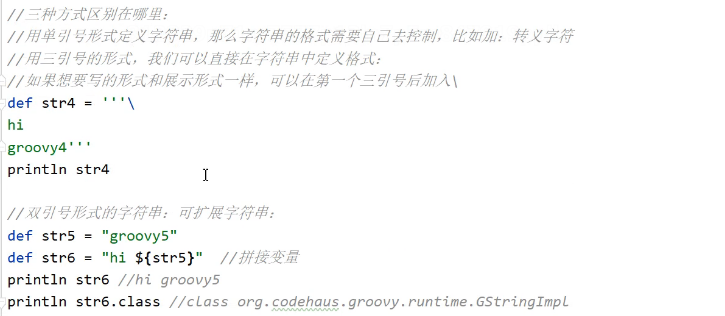

总结：

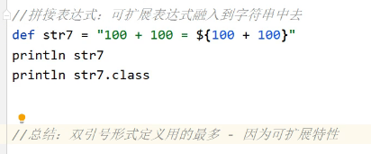

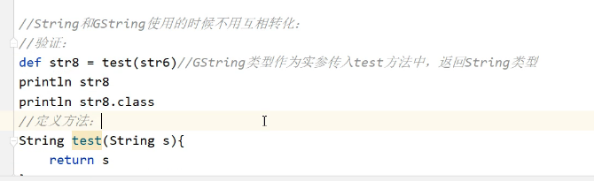

### 3.3.2 字符串的方法

*(1)可直接使用java.lang.String中的方法*

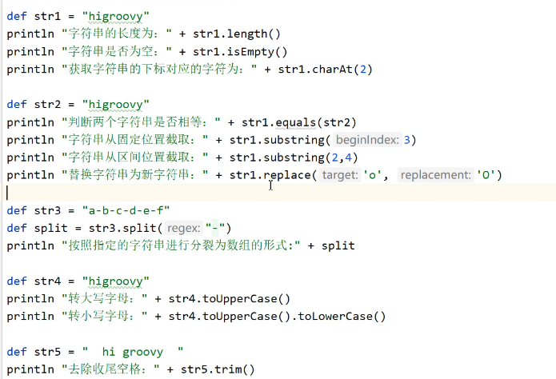

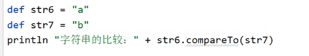

*(2)使用org.codehaus.groovy.runtimes.StringGroovyMethods中的方法*

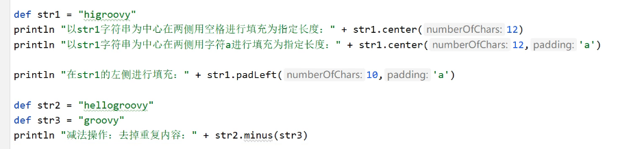

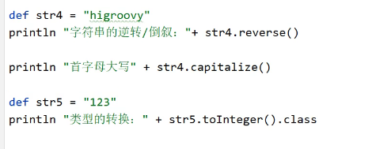

*(3)Groovy中新增的操作符*

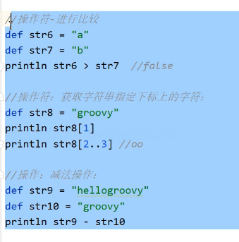

## 3.4 流程控制
流程控制分为：顺序结构、分支结构、循环结构

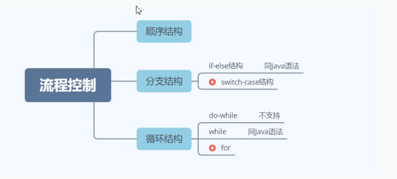

### 3.4.1 switch-case分支
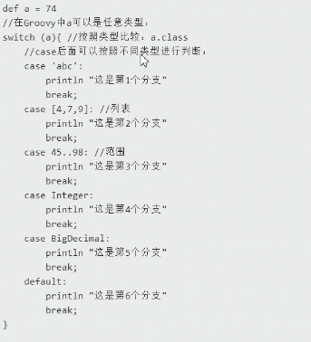

在switch-case结构中，非常灵活，所以也非常常用
### 3.4.2 for循环
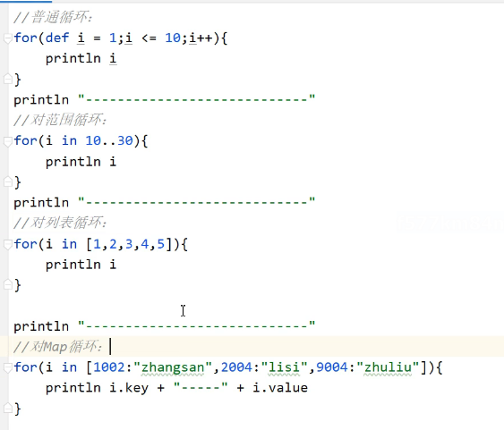

## 3.5 闭包

### 3.5.1 闭包的基本技能点

闭包的定义：

闭包就是一段代码块，用{}括起来：

闭包调用/执行

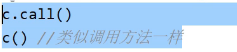

闭包传入参数

无参数：

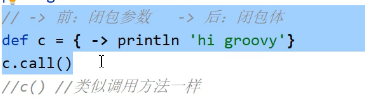

可以传入一个参数：

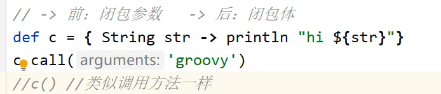

可以传入多个参数：(用逗号隔开参数即可)

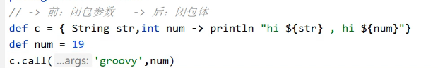

有默认的参数：

所有的闭包都有一个默认参数，不需要你显示声明，用it接收
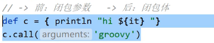

如果你不想叫it,那么就需要自己手动显示将参数定义即可，一旦定义那么就没有默认参数了（隐式参数）

闭包返回值：
闭包一定有返回值，如果不写就相当于返回null
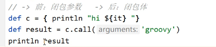

可以定义返回值：

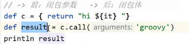

### 3.5.2 闭包的常见使用场景
* 1.与基本数据类型结合使用(for循环场景)
  
  (1)案例：从2-7进行遍历： ---upto
  

底层对应的源码：

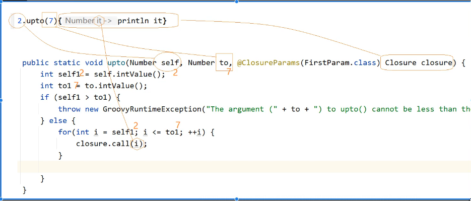

（2）案例:1+2+3+...+100 ---upto

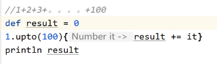

(3)案例：输出7-2  ---downto

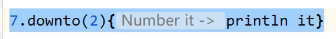

(4)案例：输出100以内的整数 ---times

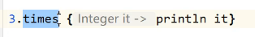

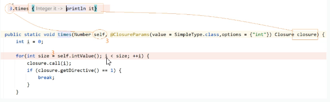

结果：

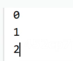

(5)案例：1+2+...+100   ---times

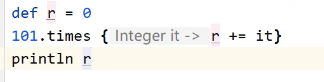

补充：写法两种

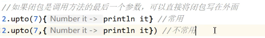

* 2.与字符串结合使用

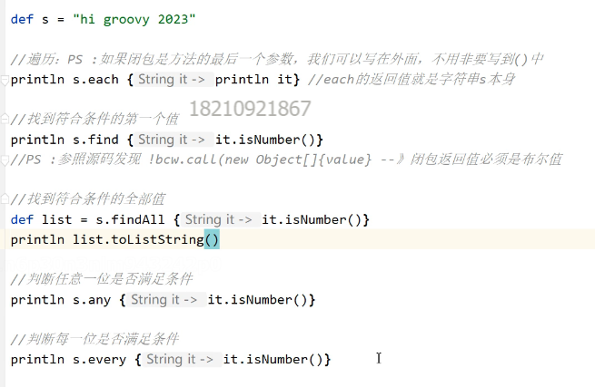

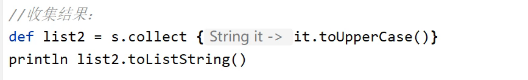

### 3.5.3 闭包中的变量
* 1、this
this代表定义该闭包的类的实例对象（实例闭包）或者类本身（静态闭包）
* 2、owner
可以和this用法一样，还可以用作：当闭包中嵌套闭包的时候，这时候owner就指向定义它的闭包对象

* 3、delegate
它的含义大多数情况下是跟owner的含义一样，除非它被显示的修改
  
在Groovy脚本中定义闭包，那么this，owner，delegate指代的都是当前所在脚本的类的对象（当前脚本编译后对应的就是一个脚本类型的类）

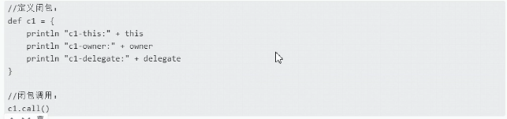

结果：

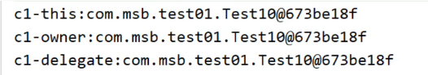

定义内部类：
如果定义内部类，那么无论是闭包中还是方法中，this、owner、delegate指代的都是所在类的对象——person对象

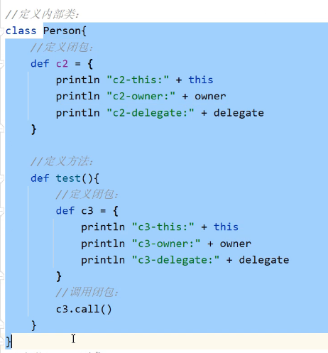

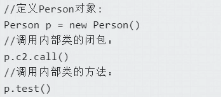

结果：

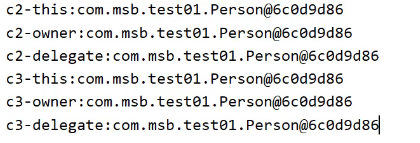

如果定义的内容是静态的，那么this、owner、delegate指代的就是所在的类——person

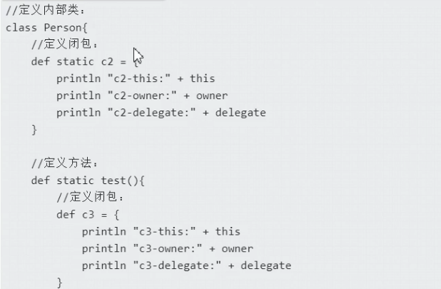

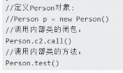

闭包中嵌套闭包：

this指代的依然是所在的类，但是owner、delegate指代的就是嵌套闭包的闭包

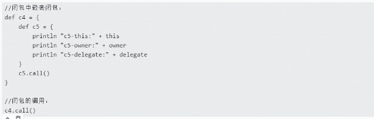

结果：

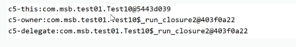

总结1：

无论什么情况下，this指代的都是所在类/类的对象
但是如果遇到闭包嵌套闭包，owner、delegate指代的就是嵌套闭包的闭包

owner、delegate不同的情况：它的含义大多数情况下是跟owner的含义一样，除非它被显示的修改

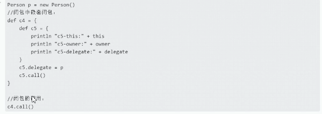

结果：

总结2：

delegate的含义大多数情况下是跟owner的含义一样，除非它被显示的修改

### 3.5.2 闭包的委托策略
PS:写脚本用的少，了解即可

结果：

原因：
${name}取值是从delegate中取值，所以delegate默认情况下指代的是当前A的对象
想要得到菲菲的结果，解决修改delegate：

但是发现修改delegate不好用，因为默认情况下delegate委托机制是owner first，所以我们需要修改委托策略：

结果：

## 3.6 列表

列表的定义:

### 3.6.2 列表的使用
添加元素、删除元素：

排序：

查找操作：

## 3.7 映射

### 3.7.1 映射的定义

### 3.7.2 映射的使用
映射的遍历：

映射的查找：

映射的排序：

## 3.8范围（Range）

## 3.9面向对象

### 3.9.1 类的定义和对象的定义

新建Groovy类：

类的定义：

对象的定义：

属性的取值：

无论是用.的方式直接取值还是用get/set的方式取值，实际底层调用的都是get/set方法

### 3.9.2 方法的定义和调用

方法的定义：

方法的调用：

方法调用补充：

### 3.9.3 接口

创建接口：

PS:在groovy中不可以定义非public类型的方法

类中实现接口：

### 3.9.4 Trait
用的少，知道即可。

定义：

在Trait中定义抽象方法和非抽象方法，定义以后就可以让类来使用（使用和接口很像，用implements来实现）：

在脚本中定义具体的对象调用方法：

运行结果：

一个类可以实现多个Trait(解决了多继承问题)

结果：

PS:Trait就像是抽象类和接口的结合，类实现用implements关键字来实现，可以实现多个Traint.

### 3.9.5元编程——方法的调用和拦截
使用运行时元编程，我们可以在运行时截取类和接口的方法。

在脚本中创建对象，然后调用方法：

发现:调用已有的eat方法，直接调用没有问题，但是调用没有的方法play会直接出错：

但是在groovy中可以用重写方法的形式来替换不存在的方法：

结果：

如果重写了methodMissing方法，会调用methodMissing方法：

结果：

### 3.9.6 元编程——metaClass

使用运行时元编程，我们可以在运行注入，合成类和接口的方法。

## 3.10 Groovy对Json的操作

### 3.10.1Groovy自带的工具类处理json方式
将对象转为json：

将json串转为对象：

### 3.10.2使用java第三方类库处理json
将第三方类库导入程序中：

类：

脚本中转换：

