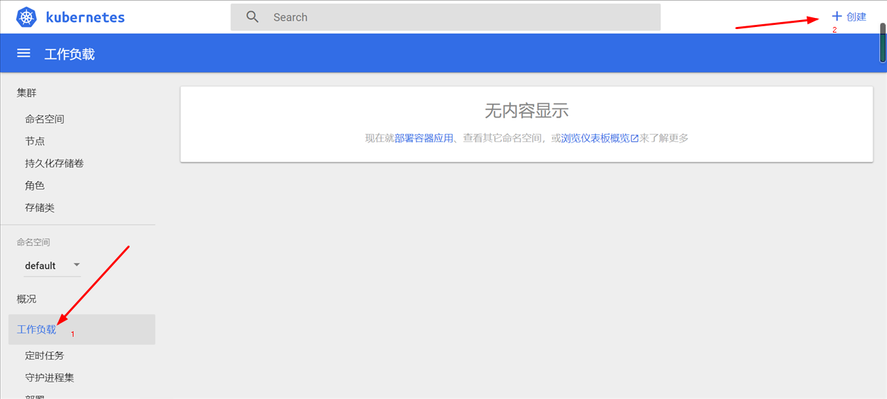
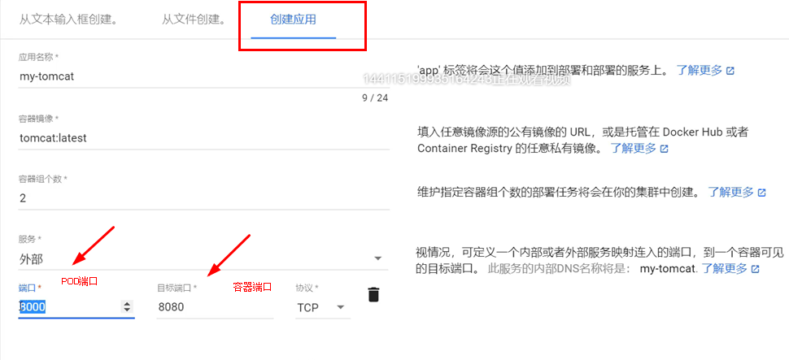
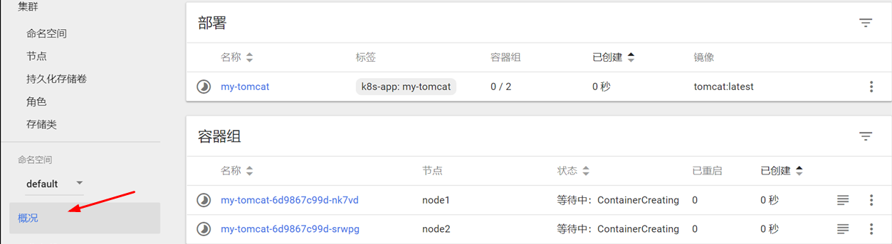
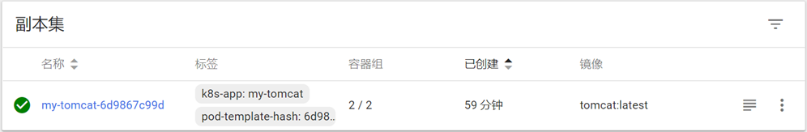
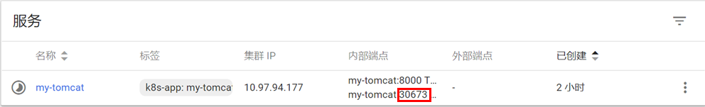
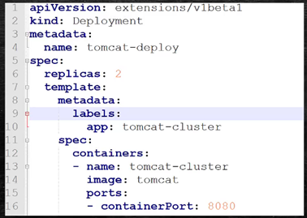
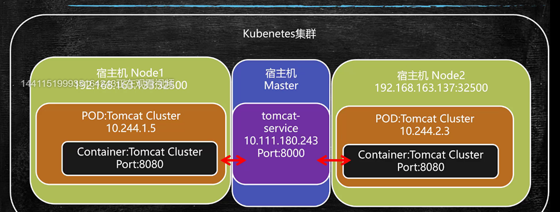
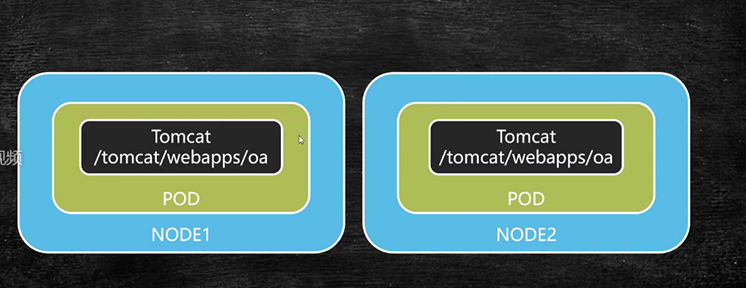
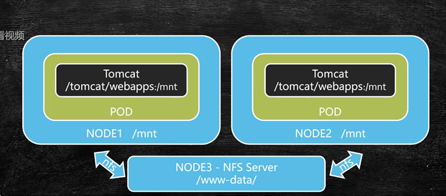
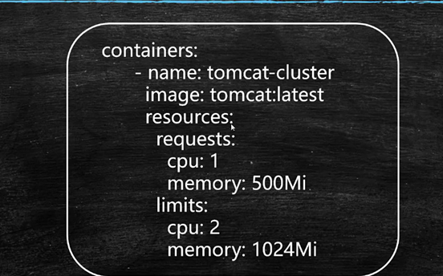

# Dashboard部署Tomcat集群
* 1.找到阿里云镜像加速器，确保每个节点都配置，否则有可能会碰到镜像无法下载的问题
* 2.再Dashboard中集群进行操作 http://192.168.80.100:32000
* 3.在左侧菜单中找到工作负载，然后单击创建，在找到创建应用


  
然后单击部署就可以，在概况菜单就可以等待创建了。


创建完成后，如何访问使用呢？


在副本集中单击名称，进入后在其中的服务中可以看到一个端口号，我们用浏览器进行访问
  此时访问就是通过node1和node2的节点进行访问

通过node1和node2的ip和这个端口就可以访问了，这个端口就是k8s分配给我们的，在实际使用的时候我们不可能用随机生成的，后边讲服务暴漏时候再讲。
K8S还可以监控我们节点上各个服务的状态，如果某个服务上的服务无辜挂掉，K8S则会重启启动一个容器
再实际使用时很少使用界面的方式部署应用，大多的时候还是通过命令的方式（编写Deployment脚本）
  
# Deployment脚本部署Tomcat集群

## Deployment(部署)
* 部署是指Kubernetes向Node节点发送指令，创建容器的过程
* Kubernetes支持yml格式的部署脚本
* kubectl create -f 部署yml文件 #创建部署

## Deployment部署脚本范本


## 于部署相关常用命令
* kubectl create -f 部署yml文件 #创建部署
* kubectl apply -f 部署yml文件 #更新部署配置
* kubectl get pod [-o wide] #查看已部署pod
* kubectl describe pod pod名称 #查看Pod详细信息
* kubectl logs [-f] pod名称 #查看pod输出日志

## 实战
```shell
[root@master local]# mkdir k8s
[root@master local]# cd k8s
[root@master k8s]# mkdir tomcat-deploy
[root@master k8s]# cd tomcat-deploy/
[root@master tomcat-deploy]# vim tomcat-deploy.yml
```
tomcat-deploy.yml内容如下：
```yml
apiVersion: extensions/v1beta1  #解析的版本
kind: Deployment                #文件类型
metadata: 
  name: tomcat-demploy             #文件名称
spec:  #部署的详细描述
  replicas: 2    #部署的副本数量
  template:
    metadata:
      labels:
        app: tomcat-cluster  #POD名称
    spec:  #用于设置我们创建容器的信息
      containers:
      - name: tomcat-cluster  #生成容器的名字
        image: tomcat:latest  #镜像来源
        ports:
        - containerPort: 8080  #对外的端口号
```
开始创建部署
```shell
[root@master tomcat-deploy]# kubectl create -f ./tomcat-deploy.yml 
deployment.extensions/tomcat-demploy created
```
查看当前所有的部署
```shell
[root@master tomcat-deploy]# kubectl get deployment
NAME             READY   UP-TO-DATE   AVAILABLE   AGE
my-tomcat        2/2     2            2           4h55m
tomcat-demploy   2/2     2            2           60m
```
可以看到tomcat-demploy已经出现了
了解更详细的信息
```shell
[root@master tomcat-deploy]# kubectl get pod -o wide
NAME                              READY   STATUS    RESTARTS   AGE     IP           NODE    NOMINATED NODE   READINESS GATES
my-tomcat-6d9867c99d-lvcfq        1/1     Running   0          4h      10.244.2.5   node2   <none>           <none>
my-tomcat-6d9867c99d-nk7vd        1/1     Running   0          4h57m   10.244.1.3   node1   <none>           <none>
tomcat-demploy-5fd4fc7ddb-r8vks   1/1     Running   0          62m     10.244.2.6   node2   <none>           <none>
tomcat-demploy-5fd4fc7ddb-tg4dt   1/1     Running   0          62m     10.244.1.4   node1   <none>           <none>

```
如果这里的信息还不够详细，我们可以复制一个name用以下命令查询
```shell
[root@master tomcat-deploy]# kubectl describe pod tomcat-demploy-5fd4fc7ddb-r8vks
Name:               tomcat-demploy-5fd4fc7ddb-r8vks
Namespace:          default
Priority:           0
PriorityClassName:  <none>
Node:               node2/192.168.80.102
Start Time:         Sun, 20 Feb 2022 15:44:39 +0800
Labels:             app=tomcat-cluster
                    pod-template-hash=5fd4fc7ddb
Annotations:        <none>
Status:             Running
IP:                 10.244.2.6
Controlled By:      ReplicaSet/tomcat-demploy-5fd4fc7ddb
Containers:
  tomcat-cluster:
    Container ID:   docker://fd6b27e8333d6abe408d1992afc6e6c4170a4c9889bb9c2d402bce14cd0b4f17
    Image:          tomcat:latest
    Image ID:       docker-pullable://tomcat@sha256:9dee185c3b161cdfede1f5e35e8b56ebc9de88ed3a79526939701f3537a52324
    Port:           8080/TCP
    Host Port:      0/TCP
    State:          Running
      Started:      Sun, 20 Feb 2022 15:44:56 +0800
    Ready:          True
    Restart Count:  0
    Environment:    <none>
    Mounts:
      /var/run/secrets/kubernetes.io/serviceaccount from default-token-jk8tn (ro)
Conditions:
  Type              Status
  Initialized       True 
  Ready             True 
  ContainersReady   True 
  PodScheduled      True 
Volumes:
  default-token-jk8tn:
    Type:        Secret (a volume populated by a Secret)
    SecretName:  default-token-jk8tn
    Optional:    false
QoS Class:       BestEffort
Node-Selectors:  <none>
Tolerations:     node.kubernetes.io/not-ready:NoExecute for 300s
                 node.kubernetes.io/unreachable:NoExecute for 300s
Events:          <none>
[root@master tomcat-deploy]# 

```
这样就可以看到某个pod最完整的信息了。
查看当前pod的日志信息呢
```shell
[root@master tomcat-deploy]# kubectl logs tomcat-demploy-5fd4fc7ddb-r8vks
```

# 外部访问Tomcat集群


这的tomcat-service也是一个POD，它和nginx类似接收请求后向后边进行转发
这里的服务可以粗浅的理解为再k8s中内置的负载均衡器它是我们访问内部容器的统一入口。
当然了也可以指定某一个宿主机对外的端口号，然后加上ip进行访问，但是这样是不推荐的。
因为指定某一个宿主机后，负载均衡器就失效了
现在开始我们就创建tomcat的服务
```shell
[root@master k8s]# mkdir tomcat-service
[root@master k8s]# cd tomcat-service/
[root@master tomcat-service]# vim tomcat-service.yml
```
tomcat-service.yml文件内容如下：
```yml
apiVersion: v1  #k8s解析的版本，和
kind: Service  #表示当前文件是一个Service
metadata:
  name: tomcat-service #标识显示的名称
  labels:
    app: tomcat-service  #pod的名称
spec:  #设置详细信息
  type: NodePort   #设置服务类型为NodePort,具体含义是我们要再每个节点开辟一个端口，和内侧tomcat进行端口映射，同时也要创建对应的服务
  selector:  #选择器
    app: tomcat-cluster  #此时的值就是之前编写tomcat-deployment.yml中的label的值，只要与当前值相同的node就会service进行绑定。
  ports:  #端口设置
  - port: 8000  #设置服务接收数据的端口
    targetPort: 8080 #设置的是容器内部对外暴露的端口
    nodePort: 32500 #设置的是每一个节点上对外暴露的端口并且和容器内部8080进行一个映射
```
创建服务
```shell
[root@master tomcat-service]# kubectl create -f ./tomcat-service.yml 
service/tomcat-service created
```
创建后不代表一定有效，我们还要检查一下,获取所有的服务列表
```shell
[root@master tomcat-service]# kubectl get service
NAME             TYPE           CLUSTER-IP     EXTERNAL-IP   PORT(S)          AGE
kubernetes       ClusterIP      10.96.0.1      <none>        443/TCP          18h
my-tomcat        LoadBalancer   10.97.94.177   <pending>     8000:30673/TCP   5h54m
tomcat-service   NodePort       10.110.20.22   <none>        8000:32500/TCP   55s
```
如果要查看service详细的信息可以执行如下命令
```shell
[root@master tomcat-service]# kubectl describe service tomcat-service
Name:                     tomcat-service
Namespace:                default
Labels:                   app=tomcat-service
Annotations:              <none>
Selector:                 app=tomcat-cluster
Type:                     NodePort
IP:                       10.110.20.22
Port:                     <unset>  8000/TCP
TargetPort:               8080/TCP
NodePort:                 <unset>  32500/TCP
Endpoints:                10.244.1.4:8080,10.244.2.6:8080
Session Affinity:         None
External Traffic Policy:  Cluster
Events:                   <none>
```
用浏览器进行测试
192.168.80.101:32500
192.168.80.102:32500


# 基于NFS文件集群共享
## Network File System - NFS
* NFS,是由SUN公司研制的文件传输协议
  此协议允许我们在网络中对文件进行共享和传输，而这些文件的使用者，在基于NFS文件共享以后，在读取文件时完全可以
  当成本地文件一样来用
* NFS主要是采用远程过程调用RPC机制实现文件传输
* yum install -y nfs-utils rpcbind  在文件的提供方来安装

如果要部署oa在每个节点，在更新维护时会很麻烦，那怎么办呢？

在另外一个节点中专门提供共享数据，也就是文件共享服务器。通过nfs协议挂载到/mnt目录
此时容器内部和mnt进行绑定即可

## 实战
选择主服务器为文件共享服务器
```shell
[root@master tomcat-service]# yum install -y nfs-utils rpcbind
```
安装成功后，我们选择一个目录来作为共享数据的目录
```shell
[root@master tomcat-service]# cd /usr/local
[root@master local]# mkdir data
[root@master local]# cd data/
[root@master data]# mkdir www-data
[root@master data]# cd www-data/
[root@master www-data]# vim /etc/exports
```
对exports的内容进行编写
```text
/usr/local/data/www-data 192.168.80.100/24(rw,sync)
```
rw表示通过网络共享的这个目录可读可写
sync表示同步写入
启动nfs服务和rpcbind服务，并且都设置为开机启动
```shell
[root@master www-data]# systemctl start nfs.service
[root@master www-data]# systemctl start rpcbind.service
[root@master www-data]# systemctl enable nfs.service
Created symlink from /etc/systemd/system/multi-user.target.wants/nfs-server.service to /usr/lib/systemd/system/nfs-server.service.
[root@master www-data]# systemctl enable rpcbind.service
```
查看
```shell
[root@master www-data]# exportfs
/usr/local/data/www-data
		192.168.80.100/24
```
看到了前边设置的内容则表示我们的配置是正确的
此时对应的文件提供方就设置完成了，接着设置文件的调用方进行设置
```shell
[root@node1 ~]# yum install -y nfs-utils
```
只需要按照nfs-utils即可
查看主服务器上对外暴漏的共享文件夹有哪些
```shell
[root@node1 ~]# showmount -e 192.168.80.100
Export list for 192.168.80.100:
/usr/local/data/www-data 192.168.80.100/24
```
显示出来后我们就进行挂载操作
```shell
[root@node1 ~]# mount 192.168.80.100:/usr/local/data/www-data /mnt
```
192.168.80.100:/usr/local/data/www-data  #表示主机上共享出来的目录
/mnt    #表示要挂载到本地哪个目录下，此时为/mnt
测试，我们在主机上www-data中创建一个文件
```shell
[root@master www-data]# vim test.txt
```
内容如下：
```text
123456
```
保存后，我们在到node1上看看挂载点是否同步了
```shell
[root@node1 ~]# cd /mnt
[root@node1 mnt]# ls
test.txt
[root@node1 mnt]# vim test.txt
```
观察内容也是我们刚才主服务器上设置的内容，在node1上进行查看操作其实都是和主机进行了通信，/mnt就是一个映射。
同样的我们把node2节点也进行同样的nfs安装及操作


# 部署配置挂载点
怎么将POD中的文件目录和我们共享服务器上的共享目录进行挂载呢？
先查询下现有部署
```shell
[root@master www-data]# kubectl get deployment
NAME             READY   UP-TO-DATE   AVAILABLE   AGE
my-tomcat        2/2     2            2           7h51m
tomcat-demploy   2/2     2            2           3h56m
```
作为重新发布我们有两个办法？
* 1.在现有部署上进行配置文件更新
* 2.删除现有的部署，重新在创建部署
我们选择第二种
```shell
[root@master www-data]# kubectl delete deployment tomcat-demploy
deployment.extensions "tomcat-demploy" deleted
[root@master www-data]# kubectl get deployment
No resources found.
[root@master www-data]# kubectl get pod
No resources found.
```
删除操作会把配置的容器，pod都删除掉，但是我们的service是不会被删除的
```shell
[root@master www-data]# kubectl get service
NAME             TYPE           CLUSTER-IP     EXTERNAL-IP   PORT(S)          AGE
kubernetes       ClusterIP      10.96.0.1      <none>        443/TCP          20h
my-tomcat        LoadBalancer   10.97.94.177   <pending>     8000:30673/TCP   7h57m
tomcat-service   NodePort       10.110.20.22   <none>        8000:32500/TCP   124m
```
我们现在把service也删除
```shell
[root@master www-data]# kubectl delete service tomcat-service
service "tomcat-service" deleted
```
现在我们开始重新部署，再次之前先修改部署文件tomcat-deployment
```shell
[root@master tomcat-deploy]# cd /usr/local/k8s/tomcat-deploy
[root@master tomcat-deploy]# vim tomcat-deploy.yml
```
修改tomcat-deploy.yml文件，内容如下：
```yml
apiVersion: extensions/v1beta1
kind: Deployment
metadata:
  name: tomcat-demploy
spec:
  replicas: 2
  template:
    metadata:
      labels:
        app: tomcat-cluster
    spec:
      volumes:   #配置数据卷，和前边学习Docker一样
      - name: web-app  #给数据卷起一个别名，自定义
        hostPath:   #配置宿主机原始目录
          path: /mnt  #在部署的时候通知k8s每一个节点中都有一个mnt进行挂载，它的别名是web-app
      containers:
      - name: tomcat-cluster
        image: tomcat:latest
        ports:
        - containerPort: 8080
        volumeMounts:  #配置容器中需要的挂载点
        - name: web-app  #这里挂载点的名字要和上边一致
          mountPath: /usr/local/tomcat/webapps #在k8s进行pod构建的时候，利用之前设置的/mnt挂载点来应用到当前这个配置的目录上
```
创建部署
```shell
[root@master tomcat-deploy]# kubectl create -f tomcat-deploy.yml 
deployment.extensions/tomcat-demploy created
[root@master tomcat-deploy]# kubectl get deployment
NAME             READY   UP-TO-DATE   AVAILABLE   AGE
tomcat-demploy   2/2     2            2           31s
```
观察pod
```shell
[root@master tomcat-deploy]# kubectl get pod -o wide
NAME                              READY   STATUS    RESTARTS   AGE   IP           NODE    NOMINATED NODE   READINESS GATES
tomcat-demploy-6678dccdc9-bxscx   1/1     Running   0          69s   10.244.1.5   node1   <none>           <none>
tomcat-demploy-6678dccdc9-whfnd   1/1     Running   0          69s   10.244.2.7   node2   <none>           <none>
```
怎么进行验证，我们先用一下笨办法
```shell
[root@node1 mnt]# docker ps
[root@node1 mnt]# docker exec -it b155a33cdf15 /bin/bash
root@tomcat-demploy-6678dccdc9-bxscx:/usr/local/tomcat# cd webapps
root@tomcat-demploy-6678dccdc9-bxscx:/usr/local/tomcat/webapps# ls
test.txt
root@tomcat-demploy-6678dccdc9-bxscx:/usr/local/tomcat/webapps# cat test.txt 
123456
```
可以看到进入容器内部后我们发现已经有了那个映射的文件
我们在主服务器上对文件进行修改后再观察一下，发现文件信息是一样的
我们再使用另一个办法，再主服务器上对全局的节点进行观察
```shell
[root@master www-data]# kubectl get pod -o wide
NAME                              READY   STATUS    RESTARTS   AGE     IP           NODE    NOMINATED NODE   READINESS GATES
tomcat-demploy-6678dccdc9-bxscx   1/1     Running   0          8m32s   10.244.1.5   node1   <none>           <none>
tomcat-demploy-6678dccdc9-whfnd   1/1     Running   0          8m32s   10.244.2.7   node2   <none>           <none>
[root@master www-data]# clear
[root@master www-data]# kubectl get pod -o wide
NAME                              READY   STATUS    RESTARTS   AGE     IP           NODE    NOMINATED NODE   READINESS GATES
tomcat-demploy-6678dccdc9-bxscx   1/1     Running   0          8m39s   10.244.1.5   node1   <none>           <none>
tomcat-demploy-6678dccdc9-whfnd   1/1     Running   0          8m39s   10.244.2.7   node2   <none>           <none>
[root@master www-data]# kubectl exec -it tomcat-demploy-6678dccdc9-bxscx /bin/bash
root@tomcat-demploy-6678dccdc9-bxscx:/usr/local/tomcat# cd webapps
root@tomcat-demploy-6678dccdc9-bxscx:/usr/local/tomcat/webapps# ls
test.txt
root@tomcat-demploy-6678dccdc9-bxscx:/usr/local/tomcat/webapps# cat test.txt 
123456789
root@tomcat-demploy-6678dccdc9-bxscx:/usr/local/tomcat/webapps#
```
这个方法就是通过kubectl exec -it tomcat-demploy-6678dccdc9-bxscx /bin/bash 命令 其中只需要变化pod的名称即可

# 利用Rinetd实现Service负载均衡

我们通过具体的节点ip再加对外暴露的端口就可以访问具体容器内部端口的应用，但是我们内部节点众多不可能让调用端决定调用哪个节点的ip
，所以最好的解决方案就是让所有的请求都进入tomcat-service,然后让其进行转发即可。通过k8s提供的服务机制我们来实现负载均衡，这么做的好处就是我们统一了
应用的入口
首先查询一下是否安装了tomcat-service服务，如果有的话，我们可以使用
kubectl delete service tomcat-service将其删除
```shell
[root@master www-data]# kubectl get service
NAME         TYPE        CLUSTER-IP   EXTERNAL-IP   PORT(S)   AGE
kubernetes   ClusterIP   10.96.0.1    <none>        443/TCP   21h
[root@master www-data]# cd /usr/local/k8s/tomcat-service
[root@master tomcat-service]# vim tomcat-service.yml
```
将之前tomcat-service.yml文件进行修改，修改点就是注释以下代码
```yml
apiVersion: v1
kind: Service
metadata:
  name: tomcat-service
  labels:
    app: tomcat-service
spec:
# type: NodePort  #NodePort的弊端就是我们必须知道后端每个节点的ip来进行访问，所以我们再这里把它注释了
  selector:
    app: tomcat-cluster
  ports:
  - port: 8000
    targetPort: 8080
#   nodePort: 32500  #这个也注释了
```
注释掉之前的两行代码就可以了
```shell
[root@master tomcat-service]# kubectl create -f tomcat-service.yml 
service/tomcat-service created
[root@master tomcat-service]# kubectl get service
NAME             TYPE        CLUSTER-IP      EXTERNAL-IP   PORT(S)    AGE
kubernetes       ClusterIP   10.96.0.1       <none>        443/TCP    22h
tomcat-service   ClusterIP   10.104.88.111   <none>        8000/TCP   20s
[root@master tomcat-service]# kubectl describe service tomcat-service
Name:              tomcat-service
Namespace:         default
Labels:            app=tomcat-service
Annotations:       <none>
Selector:          app=tomcat-cluster
Type:              ClusterIP
IP:                10.104.88.111
Port:              <unset>  8000/TCP
TargetPort:        8080/TCP
Endpoints:         10.244.1.5:8080,10.244.2.7:8080
Session Affinity:  None
Events:            <none>
[root@master tomcat-service]#
```
进行验证
```shell
[root@master tomcat-service]# curl 10.104.88.111:8000
<!doctype html><html lang="en"><head><title>HTTP Status 404 – Not Found</title><style type="text/css">body {font-family:Tahoma,Arial,sans-serif;} h1, h2, h3, b {color:white;background-color:#525D76;} h1 {font-size:22px;} h2 {font-size:16px;} h3 {font-size:14px;} p {font-size:12px;} a {color:black;} .line {height:1px;background-color:#525D76;border:none;}</style></head><body><h1>HTTP Status 404 – Not Found</h1><hr class="line" /><p><b>Type</b> Status Report</p><p><b>Description</b> The origin server did not find a current representation for the target resource or is not willing to disclose that one exists.</p><hr class="line" /><h3>Apache Tomcat/10.0.14</h3></body></html>[root@master tomcat-service]#
```
此时能看到请求转发给了node1或node2的节点，为了更清楚，我们创建一个web应用
我们进入之前在主服务器上设置的共享目录
```shell
[root@master tomcat-service]# cd /usr/local/data/www-data/
[root@master www-data]# mkdir test
[root@master www-data]# cd test
[root@master test]# vim index.jsp
```
index.jsp的内容如下，显示当前请求的本地ip地址
```jsp
<%=request.getLocalAddr()%>
```
然后再进行测试
```shell
[root@master test]# curl 10.104.88.111:8000/test/index.jsp
10.244.2.7
[root@master test]# curl 10.104.88.111:8000/test/index.jsp
10.244.1.5
[root@master test]# curl 10.104.88.111:8000/test/index.jsp
10.244.2.7
[root@master test]# curl 10.104.88.111:8000/test/index.jsp
10.244.2.7
[root@master test]# curl 10.104.88.111:8000/test/index.jsp
10.244.1.5
[root@master test]#
```
我们发现请求被随机分配到了各个节点，k8s的负载均衡策略是随机分配。
这样我们就通过8000端口实现了后端服务的负载均衡策略。
但是还有一个问题就是10.104.88.111这个ip地址不是一个真实的ip地址，那作为内部的ip地址，可以再各个节点之中
访问，这些ip都由k8s统一管理，但是外侧通过192.168.80.10怎么访问呢？
那就是如何把192.168.80.10和10.104.88.111做一个映射，让我们从外部可以访问到内部。
这就涉及一个端口转发的工作。有一个工具Rinetd

## 端口转发工具-Rinetd
* Rinetd是Linux操作系统中为重定向传输控制协议工具
* 可将源IP端口数据转发至目标IP端口
* 在Kubernetes中用于将service服务对外暴露

### 安装步骤
```shell
[root@master test]# cd /usr/local
[root@master local]# wget http://www.boutell.com/rinetd/http/rinetd.tar.gz
```
又可能会下载失败，我们就要单独上传一个源码包,然后解压缩
```shell
[root@master local]# tar -zxvf rinetd.tar.gz
```
解压缩成功后，会产生一个新的目录rinetd，进入,然后修改一个地方
```shell
[root@master local]# cd rinetd
[root@master rinetd]# sed -i 's/65536/65535/g' rinetd.c  #修改可以映射的端口范围
[root@master rinetd]# mkdir -p /usr/man/        #rinetd的要求，必须手动创建
[root@master rinetd]# yum install -y gcc  #安装c语言源代码的编辑器
[root@master rinetd]# make && make install  #进行安装
cc -DLINUX -g   -c -o rinetd.o rinetd.c
rinetd.c:176:6: warning: conflicting types for built-in function ‘log’ [enabled by default]
 void log(int i, int coSe, int result);
      ^
cc -DLINUX -g   -c -o match.o match.c
gcc rinetd.o match.o -o rinetd
install -m 700 rinetd /usr/sbin
install -m 644 rinetd.8 /usr/man/man8

```
看700和644就表示rinetd安装成功了
然后编辑端口映射规则
```shell
[root@master rinetd]# vim /etc/rinetd.conf
```
rinetd.conf文件内容如下：
```text
0.0.0.0 8000 10.104.88.111 8000

```
**0.0.0.0 8000** 表示允许哪些ip地址对内部**10.104.88.111端口是8000**的应用进行访问，这里的**0.0.0.0**表示任意ip，*8000*代表
master宿主机上开辟8000端口，将8000中端口的请求转发给内部**10.104.88.111端口是8000**的应用
保存后对这个文件进行加载
```shell
[root@master rinetd]# rinetd -c /etc/rinetd.conf
```
验证 ，
```shell
[root@master rinetd]# netstat -tulpn
```
通过执行以上命令，我们发现本地8000端口在监听端口
```shell
tcp        0      0 0.0.0.0:8000            0.0.0.0:*               LISTEN      88246/rinetd
```
用外部浏览器进行访问验证
http://192.168.80.100:8000/test/index.jsp

## 总结
通过K8S暴露内部服务的方案有两个
* 1.通过节点的端口对外暴露内部服务
* 2.通过Service后台关联的服务，在通过service与我们宿主机之间的某个端口绑定对外提供统一的交互接口


# 集群配置调整与资源限定

## K8S部署调整命令
* 更新集群配置
* kubectl apply -f yml文件路径
* 删除部署(Deployment)|服务(Service)
* kubectl delete deployment|service 部署|服务名称

## 资源限定

requests表示需要资源，只要满足此要求的节点才会被部署
limits表示容器最多使用多少资源
其中cpu可以写小数比如0.5 表示0.5核空闲
*科普*
作为CPU单位指核。

## 演示
```shell
[root@master rinetd]# cd /usr/local/k8s/tomcat-deploy
[root@master tomcat-deploy]# vim tomcat-deploy.yml
```
在此文件中添加resources

```yml
apiVersion: extensions/v1beta1
kind: Deployment
metadata:
  name: tomcat-demploy
spec:
  replicas: 2
  template:
    metadata:
      labels:
        app: tomcat-cluster
    spec:
      volumes:
      - name: web-app
        hostPath:
          path: /mnt
      containers:
      - name: tomcat-cluster
        image: tomcat:latest
        resources:  #进行资源限定
          requests:   #对创建容器的最小要求，cpu和memory都要满足
            cpu: 0.5    #至少空闲0.5核v1beta1
            memory: 200Mi  #至少有200M内存空间
          limits:   #对资源最多使用的限制
            cpu: 1   #最多使用1个cpu核
            memory: 512Mi  #内存最多使用512M
        ports:
        - containerPort: 8080
        volumeMounts:
        - name: web-app
          mountPath: /usr/local/tomcat/webapps

```
查询之前是否已经部署过了
```shell
[root@master tomcat-deploy]# kubectl get deployment
NAME             READY   UP-TO-DATE   AVAILABLE   AGE
tomcat-demploy   2/2     2            2           138m

```
针对已有的部署可以进行部署的更新
```shell
[root@master tomcat-deploy]# kubectl apply -f tomcat-deploy.yml 
Warning: kubectl apply should be used on resource created by either kubectl create --save-config or kubectl apply
deployment.extensions/tomcat-demploy configured
[root@master tomcat-deploy]# kubectl get deployment
NAME             READY   UP-TO-DATE   AVAILABLE   AGE
tomcat-demploy   2/2     2            2           139m
```
这样底层对CPU和内存的的要求已经更新了
我们可以对数量进行动态的要求
比如在tomcat-deploy.yml文件中对replicas变更为3，然后重新进行更新
```yml
apiVersion: extensions/v1beta1
kind: Deployment
metadata:
  name: tomcat-demploy
spec:
  replicas: 3
  template:
    metadata:
      labels:
        app: tomcat-cluster
    spec:
      volumes:
      - name: web-app
        hostPath:
          path: /mnt
      containers:
      - name: tomcat-cluster
        image: tomcat:latest
        resources:
          requests:
            cpu: 0.5
            memory: 200Mi
          limits:
            cpu: 1
            memory: 512Mi
        ports:
        - containerPort: 8080
        volumeMounts:
        - name: web-app
          mountPath: /usr/local/tomcat/webapps

```
```shell
[root@master tomcat-deploy]# kubectl apply -f tomcat-deploy.yml 
Warning: kubectl apply should be used on resource created by either kubectl create --save-config or kubectl apply
deployment.extensions/tomcat-demploy configured
[root@master tomcat-deploy]# kubectl get deployment
NAME             READY   UP-TO-DATE   AVAILABLE   AGE
tomcat-demploy   3/3     3            3           142m
```
就变成了3个节点了
查看pod详细信息
```shell
[root@master tomcat-deploy]# kubectl get pod -o wide
NAME                              READY   STATUS    RESTARTS   AGE     IP           NODE    NOMINATED NODE   READINESS GATES
tomcat-demploy-6765889cd7-k2rxw   1/1     Running   0          4m29s   10.244.1.6   node1   <none>           <none>
tomcat-demploy-6765889cd7-kl9ct   1/1     Running   0          62s     10.244.2.9   node2   <none>           <none>
tomcat-demploy-6765889cd7-qcltm   1/1     Running   0          4m29s   10.244.2.8   node2   <none>           <none>
```
在node2上创建了新的pod，这里有个问题，k8s依据什么来决定在哪个节点创建pod呢？
在默认情况下k8s采用可用资源优先的原则，也就是说哪个服务器的负载低，我就把这个pod发布到哪个节点上，当然了，我们也可以指定将这个pod发布到哪个节点上。