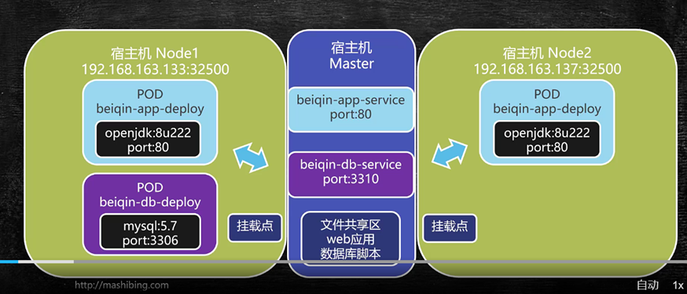

# K8S构建贝亲婴童商城
## 项目拓扑结构


## 构建NFS文件共享
* 1.在master的主服务器上长传素（beiqin）到/usr/local目录下
* 2.建立文件共享目录
```shell
vim /etc/exports
```
在这个文件中设置文件共享目录，之前已有另一个，我们在这里追加所需要
```text
/usr/local/data/www-data 192.168.80.100/24(rw,sync)
/usr/local/beiqin/dist 192.168.80.100/24(rw,sync)
/usr/local/beiqin/sql 192.168.80.100/24(rw.sync)
```
保存后，重启服务
```shell
systemctl restart nfs.service
systemctl restart rpcbind.service
```
验证
```shell
[root@master ~]# exportfs
/usr/local/data/www-data
		192.168.80.100/24
/usr/local/beiqin/dist
		192.168.80.100/24
/usr/local/beiqin/sql
		192.168.80.100/24

```
* 3.在对应节点(node1和node2)实现挂载
首先创建挂载点
```shell
mkdir /usr/local/beiqin-dist
mkdir /usr/local/beiqin-sql
mount 192.168.80.100:/usr/local/beiqin/dist /usr/local/beiqin-dist
mount 192.168.80.100:/usr/local/beiqin/sql /usr/local/beiqin-sql
```
验证
```shell
[root@node1 ~]# ls /usr/local/beiqin-dist
application.yml  beiqin-app.jar
[root@node1 ~]# ls /usr/local/beiqin-sql
beiqin.sql

```

## 部署Web应用
* 1.在master节点编写数据库的部署脚本
```shell
[root@master ~]# cd /usr/local/beiqin/
[root@master beiqin]# vim beiqin-db-deploy.yml
```
beiqin-db-deploy.yml内容如下：
```yml
apiVersion: apps/v1beta1   #在K8S 1.6以前使用的是extensions/v1beta1 1.6以后都使用apps/v1beta1
kind: Deployment   
metadata:
  name: beiqin-db-deploy  #注意命名规则
spec:  #说明详细信息
  replicas: 1  #数据库设置成1个副本
  template:  #模板设置选项
    metadata:  #元数据信息
      labels:  #设置标签
        app: beiqin-db-deploy #一般情况下和metdata.name保持一致
    spec:   
      volumes:  #设置挂载点
      - name: beiqin-db-volume  #设置挂载点名称
        hostPath:  #主机路径
          path: /usr/local/beiqin-sql #共享文件夹路径
      containers:  #设置容器相关信息
      - name: beiqin-db-deploy #容器名称，与metdata.name保持一致
        image: mysql:5.7 #镜像
        ports: #对外暴露的端口
        - containerPort: 3306  #容器端口
        env:   #
        - name: MYSQL_ROOT_PASSWORD #设置root的密码
          value: "root"  #必须用引号引起来 表示字符串
        volumeMounts:  # 进行挂载
        - name: beiqin-db-volume #这个名字要和上边的定义保持一致
          mountPath: /docker-entrypoint-initdb.d #挂载到容器哪个目录，这个目录用于初始化sql

```
* 2.保持后进行创建
```shell
[root@master beiqin]# kubectl create -f beiqin-db-deploy.yml 
deployment.apps/beiqin-db-deploy created
```
* 3.查看是否启动正常
```shell
NAME                               READY   STATUS    RESTARTS   AGE
beiqin-db-deploy-c7785f9d4-857pv   1/1     Running   0          5m27s
```
* 4.进入容器内部查看
```shell
[root@master beiqin]# kubectl exec -it beiqin-db-deploy-c7785f9d4-857pv /bin/bash
root@beiqin-db-deploy-c7785f9d4-857pv:/# mysql -uroot -proot
mysql: [Warning] Using a password on the command line interface can be insecure.
Welcome to the MySQL monitor.  Commands end with ; or \g.
Your MySQL connection id is 2
Server version: 5.7.36 MySQL Community Server (GPL)

Copyright (c) 2000, 2021, Oracle and/or its affiliates.

Oracle is a registered trademark of Oracle Corporation and/or its
affiliates. Other names may be trademarks of their respective
owners.

Type 'help;' or '\h' for help. Type '\c' to clear the current input statement.

mysql> show databases;
+--------------------+
| Database           |
+--------------------+
| information_schema |
| beiqin             |
| mysql              |
| performance_schema |
| sys                |
+--------------------+
5 rows in set (0.00 sec)

mysql> use beiqin;
Reading table information for completion of table and column names
You can turn off this feature to get a quicker startup with -A

Database changed
mysql> show tables;
+---------------------+
| Tables_in_beiqin    |
+---------------------+
| t_category          |
| t_evaluate          |
| t_goods             |
| t_goods_cover       |
| t_goods_detail      |
| t_goods_param       |
| t_promotion_seckill |
+---------------------+
7 rows in set (0.00 sec)

mysql>
```
至此数据库已经创建并初始化完毕
* 5.创建一个service对刚才创建的数据库端口进行暴露
```shell
[root@master beiqin]# cd /usr/local/beiqin/
[root@master beiqin]# vim beiqin-db-service.yml
```
beiqin-db-service.ymln内容如下：
```yml
apiVersion: v1  
kind: Service  #用于描述Service
metadata:
  name: beiqin-db-service
  labels:
    app: beiqin-db-service
spec:
  selector:  #选择哪些pod对外暴露
    app: beiqin-db-deploy #上边部署的db的pod对外保留
  ports:  #设置对外暴露端口
  - port: 3310   #service对外暴露的端口
    targetPort: 3306  #容器内部对外暴露的端口
```
保存并发布
```shell
[root@master beiqin]# kubectl create -f beiqin-db-service.yml 
service/beiqin-db-service created
[root@master beiqin]# kubectl get svc   #svc是service的简写
NAME                TYPE        CLUSTER-IP      EXTERNAL-IP   PORT(S)    AGE
beiqin-db-service   ClusterIP   10.101.135.62   <none>        3310/TCP   31s
kubernetes          ClusterIP   10.96.0.1       <none>        443/TCP    4d
tomcat-service      ClusterIP   10.104.88.111   <none>        8000/TCP   3d2h

```
查看service的详细内容，看后端是否完成了绑定
```shell
[root@master beiqin]# kubectl describe service beiqin-db-service
Name:              beiqin-db-service
Namespace:         default
Labels:            app=beiqin-db-service
Annotations:       <none>
Selector:          app=beiqin-db-deploy
Type:              ClusterIP
IP:                10.101.135.62
Port:              <unset>  3310/TCP
TargetPort:        3306/TCP
Endpoints:         10.244.1.9:3306
Session Affinity:  None
Events:            <none>

```
这样我们的服务就成功了

## 部署Web应用
查看目前的service
```shell
[root@master ~]# kubectl get svc
NAME                TYPE        CLUSTER-IP      EXTERNAL-IP   PORT(S)    AGE
beiqin-db-service   ClusterIP   10.101.135.62   <none>        3310/TCP   46h
kubernetes          ClusterIP   10.96.0.1       <none>        443/TCP    5d22h
tomcat-service      ClusterIP   10.104.88.111   <none>        8000/TCP   5d

```
编写web应用的部署文件
```shell
[root@master ~]# cd /usr/local/beiqin/
[root@master beiqin]# vim beiqin-app-deploy.yml
```
编写beiqin-app-deploy.yml文件内容
```yml
apiVersion: apps/v1beta1
kind: Deployment  
metadata:
  name: beiqin-app-deploy
spec:
  replicas: 2  #部署两个应用副本
  template:
    metadata:
      labels:
        app: beiqin-app-deploy
    spec:
      volumes:
      - name : beqin-app-volume  #设置数据卷
        hostPath:
          path: /usr/local/beiqin-dist #宿主机上的目录
      containers:
      - name: beiqin-app-deploy
        image: openjdk:8u222-jre
        command: ["/bin/sh"]  #部署完容器默认执行的命令
        args: ["-c","cd /usr/local/beiqin-dist;java -jar beiqin-app.jar"]  #command的参数，
                #连起来再linux中执行的命令就是/bin/bash -c cd /usr/local/beiqin-dist;java -jar beiqin-app.jar 
        volumeMounts:
        - name: beqin-app-volume
          mountPath: /usr/local/beiqin-dist #容器内部目录

```
保存并执行
```shell
[root@master beiqin]# kubectl create -f beiqin-app-deploy.yml 
deployment.apps/beiqin-app-deploy created
```
此时我们就部署了app容器，可以查看启动状态
```shell
[root@master beiqin]# kubectl get pod
NAME                                 READY   STATUS    RESTARTS   AGE
beiqin-app-deploy-596fd7c4dd-jnjpv   1/1     Running   0          2m37s
beiqin-app-deploy-596fd7c4dd-mmktc   1/1     Running   0          2m37s
beiqin-db-deploy-c7785f9d4-857pv     1/1     Running   2          2d20h
tomcat-demploy-6765889cd7-k2rxw      1/1     Running   3          5d20h
tomcat-demploy-6765889cd7-kl9ct      1/1     Running   4          5d20h
tomcat-demploy-6765889cd7-qcltm      1/1     Running   4          5d20h
```
status都为Running时代表启动成功了，
此时不要忘记修改连接数据库的配置文件，内容如下：
```yml
server:
  port: 80
spring:
  datasource:
    driver-class-name: com.mysql.jdbc.Driver
    url: jdbc:mysql://beiqin-db-service:3310/beiqin?useUnicode=true&characterEncoding=utf-8&useSSL=false
    username: root
    password: root
  mvc:
    favicon:
      enabled: false
mybatis:
  mapper-locations: classpath:/mapper/*.xml
  configuration:
    map-underscore-to-camel-case: true

```
通过服务名可以直接路由到对应的虚拟ip地址上
```yml
[root@master beiqin]# kubectl get svc
NAME                TYPE        CLUSTER-IP      EXTERNAL-IP   PORT(S)    AGE
beiqin-db-service   ClusterIP   10.101.135.62   <none>        3310/TCP   47h
kubernetes          ClusterIP   10.96.0.1       <none>        443/TCP    5d23h
tomcat-service      ClusterIP   10.104.88.111   <none>        8000/TCP   5d1h

```

如果部署文件有修改，我们就执行删除部署，然后重新部署

查看pod的详细信息
```shell
[root@master beiqin]# kubectl get pod -o wide
NAME                                 READY   STATUS    RESTARTS   AGE     IP            NODE    NOMINATED NODE   READINESS GATES
beiqin-app-deploy-596fd7c4dd-jnjpv   1/1     Running   0          3m3s    10.244.2.22   node2   <none>           <none>
beiqin-app-deploy-596fd7c4dd-mmktc   1/1     Running   0          3m3s    10.244.1.19   node1   <none>           <none>
beiqin-db-deploy-c7785f9d4-857pv     1/1     Running   2          2d20h   10.244.1.17   node1   <none>           <none>
tomcat-demploy-6765889cd7-k2rxw      1/1     Running   3          5d20h   10.244.1.18   node1   <none>           <none>
tomcat-demploy-6765889cd7-kl9ct      1/1     Running   4          5d20h   10.244.2.20   node2   <none>           <none>
tomcat-demploy-6765889cd7-qcltm      1/1     Running   4          5d20h   10.244.2.19   node2   <none>           <none>

```
测试
```shell
curl 10.244.2.22/goods?gid=1788
```
如果访问正常就可以得到相应产品页面的htm响应代码了。但是此时的访问只能再节点内部进行，如果要对外暴露，我们还要创建对应的service以及端口转发
利用beiqin-db-service.yml创建一个beiqin-app-service.yml的文件，文件内容如下：
```yml
apiVersion: v1
kind: Service
metadata:
  name: beiqin-app-service
  labels:
    app: beiqin-app-service
spec:
  selector:
    app: beiqin-app-deploy
  ports:
  - port: 80
    targetPort: 80
```
保存后来创建service
```shell
[root@master beiqin]# kubectl create -f beiqin-app-service.yml 
service/beiqin-app-service created
```
service已创建，我们来检查一下
```shell
[root@master beiqin]# kubectl describe service beiqin-app-service
Name:              beiqin-app-service
Namespace:         default
Labels:            app=beiqin-app-service
Annotations:       <none>
Selector:          app=beiqin-app-deploy
Type:              ClusterIP
IP:                10.101.248.126
Port:              <unset>  80/TCP
TargetPort:        80/TCP
Endpoints:         10.244.1.19:80,10.244.2.22:80
Session Affinity:  None
Events:            <none>
```
此时暴露的ip是10.101.248.126，映射的端口是80，后端对应两个节点，分别是10.244.1.19:80,10.244.2.22:80
此时说明Service已经配置成功了。
测试
```shell
curl 10.101.248.126/goods?gid=1788
```
可以正常访问，但是这个ip*10.101.248.126*只能再我们宿主机内部进行访问，因为这个ip是虚拟的，为了解决这个问题，我们还需要进行宿主机和这个ip地址的转发，
用到的工具就是rinetd
```shell
[root@master beiqin]# vim /etc/rinetd.conf
```
追加内容：
```text
0.0.0.0 80 10.101.248.126 80
```
进行加载
```shell
[root@master beiqin]# rinetd -c /etc/rinetd.conf
```
测试
在外部用浏览器进行测试
http://192.168.80.100/goods?gid=1788


