# TCP/IP协议群做了哪些事情？
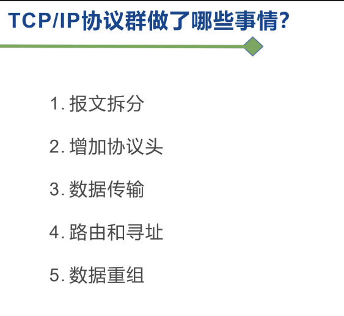

# TCP协议为什么是3次握手4次挥手？

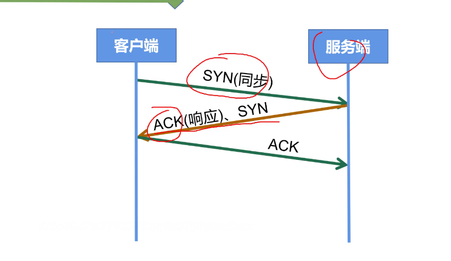

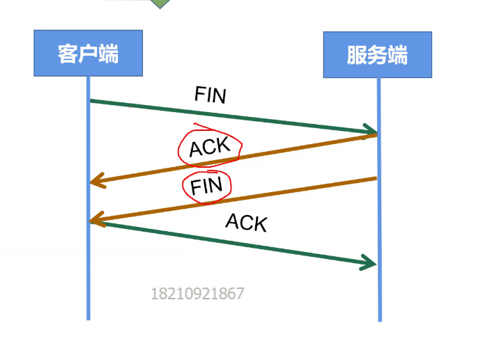

# IPv4和Ipv6的区别
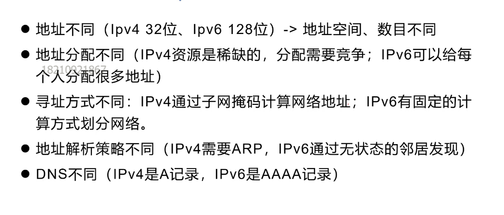

#TCP和UDP的区别
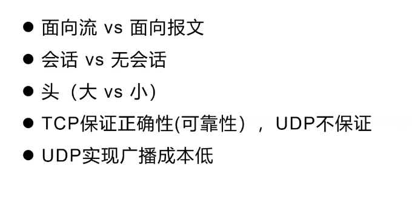

#TCP如何确保数据顺序
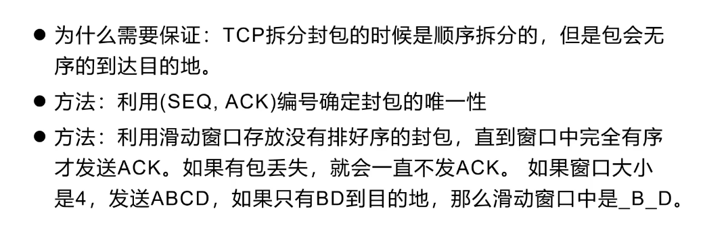

# 题目
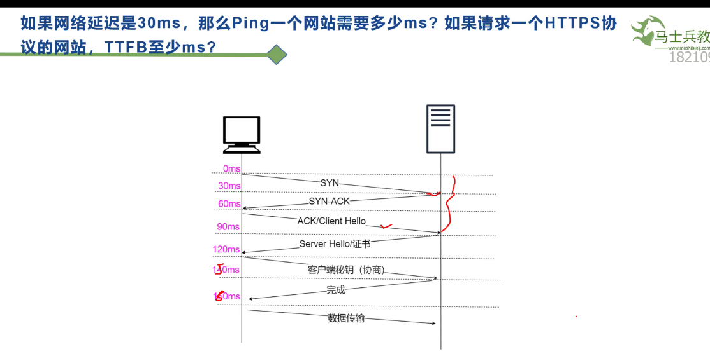

# CDN更换图片？缓存更新？
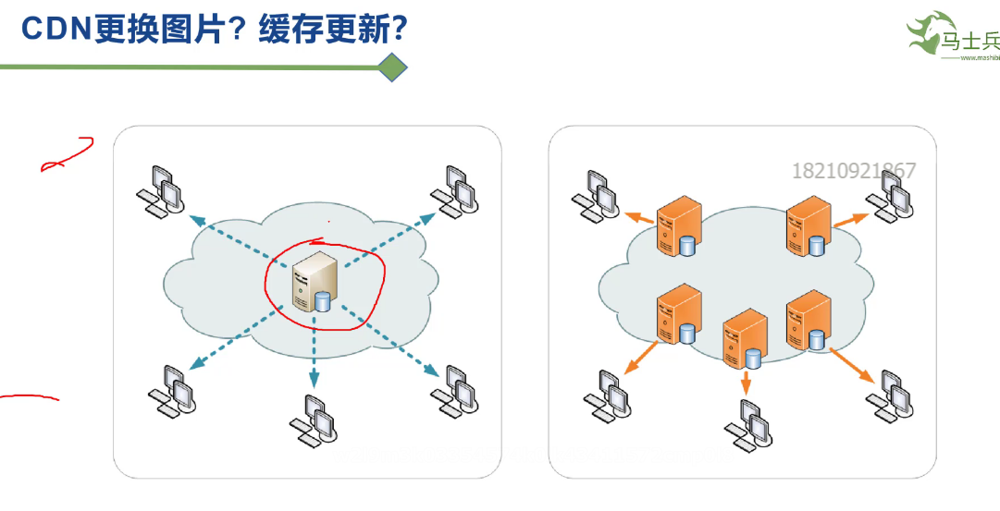

#LRU算法
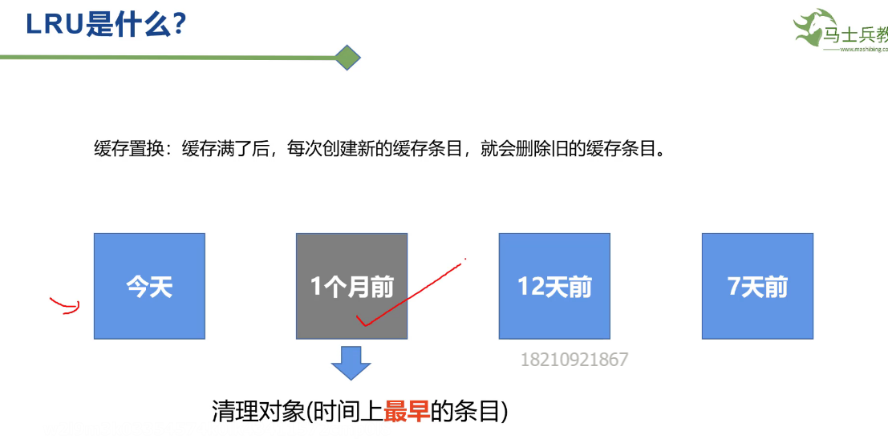

# 什么是中间人攻击
根证书是OS装进来的

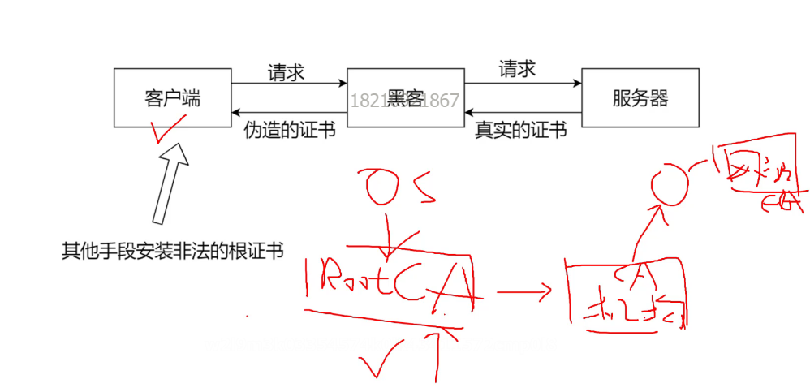

# NIO有什么优势？

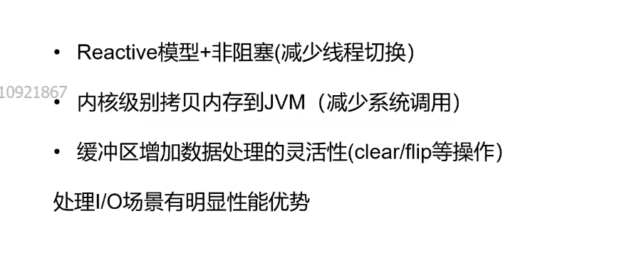

#一次DNS查询最快和最差差距有多大？
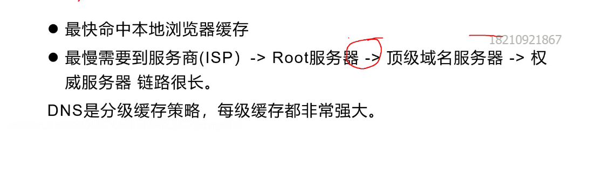

没有一致性的情况下或最终一致性的情况下挡住高并发可以参考DNS分级缓存

#HTTP keep-alive和http2.0的多路复用有什么区别？

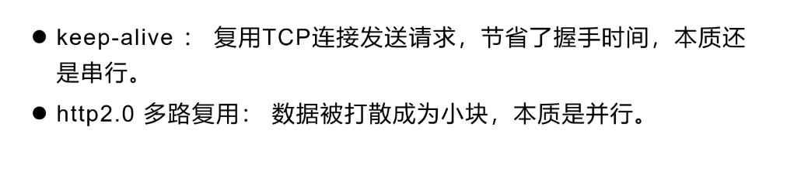

#强制缓存和协商缓存的区别
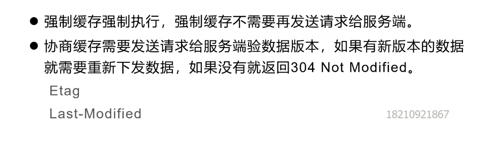

#正向代理和反向代理的区别

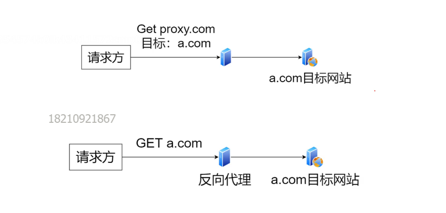

